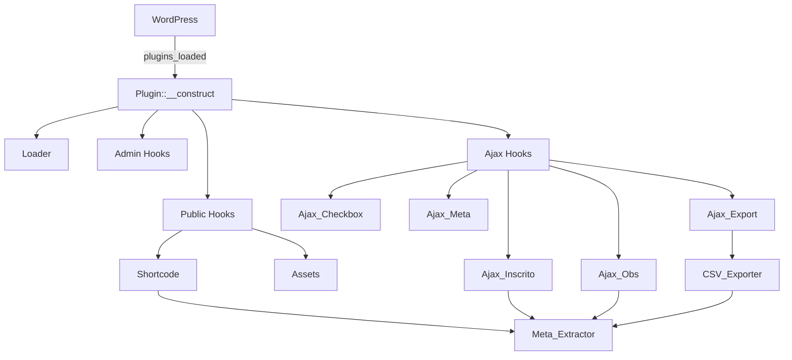

# Arquitetura do Sistema

## Visão Geral da Arquitetura

O plugin **Inscrições Pagas** segue uma arquitetura modular baseada no padrão WordPress Plugin API, com separação clara de responsabilidades entre camadas Admin, Public e Ajax. A estrutura é orientada a objetos com tipagem estrita PHP 7.4+, seguindo princípios SOLID e Clean Code.

O sistema opera como um plugin WordPress monolítico que se integra ao WooCommerce para extrair e gerenciar metadados de pedidos. As requisições do usuário são processadas via shortcode (frontend) ou AJAX (operações assíncronas), com dados extraídos do WooCommerce e apresentados em uma interface interativa.

## Camadas Arquiteturais

### **Core** - Núcleo do Plugin
- **Localização**: `includes/class-plugin.php`, `includes/class-loader.php`
- **Responsabilidade**: Orquestração de hooks, inicialização de módulos, gerenciamento do ciclo de vida
- **Classes principais**: `Plugin`, `Loader`, `Activator`, `Deactivator`

### **Helpers** - Utilitários e Lógica de Negócio
- **Localização**: `includes/Helpers/`
- **Responsabilidade**: Extração de metadados WooCommerce, exportação CSV, transformação de dados
- **Classes principais**: `Meta_Extractor`, `CSV_Exporter`

### **Admin** - Painel Administrativo
- **Localização**: `includes/Admin/`
- **Responsabilidade**: Funcionalidades do WordPress admin (futuras configurações)
- **Classes principais**: `Admin`

### **Public** - Frontend Público
- **Localização**: `includes/Public/`
- **Responsabilidade**: Renderização de shortcodes, enfileiramento de assets
- **Classes principais**: `Shortcode`, `Assets`

### **Ajax** - Handlers de Requisições Assíncronas
- **Localização**: `includes/Ajax/`
- **Responsabilidade**: Processamento de operações CRUD via AJAX
- **Classes principais**: `Ajax_Base`, `Ajax_Inscrito`, `Ajax_Obs`, `Ajax_Checkbox`, `Ajax_Meta`, `Ajax_Export`

## Padrões de Design Detectados

| Padrão | Confiança | Localização | Descrição |
|--------|-----------|-------------|-----------|
| **Loader Pattern** | 95% | `class-loader.php` | Centraliza registro de hooks WordPress |
| **Template Method** | 90% | `Ajax_Base` | Classe base abstrata para handlers AJAX |
| **Extractor Pattern** | 85% | `Meta_Extractor` | Extração e transformação de metadados |
| **Facade** | 80% | `Plugin` | Interface simplificada para módulos complexos |
| **Strategy** | 75% | Handlers Ajax | Diferentes estratégias para operações CRUD |

## Pontos de Entrada

- **`@inscricoes-pagas.php:171`** - Hook `plugins_loaded` inicializa o plugin
- **`@includes/class-plugin.php:53`** - Construtor da classe `Plugin` orquestra módulos
- **`@includes/Public/class-shortcode.php`** - Renderização do shortcode `[inscricoes_pagas]`
- **`@includes/Ajax/class-ajax-*.php`** - Handlers AJAX registrados via `wp_ajax_*`

## API Pública

| Símbolo | Tipo | Localização |
|---------|------|-------------|
| `inscricoes_pagas_init` | Function | `inscricoes-pagas.php:150` |
| `inscricoes_pagas_activate` | Function | `inscricoes-pagas.php:128` |
| `inscricoes_pagas_deactivate` | Function | `inscricoes-pagas.php:137` |
| `InscricoesPagas\Plugin` | Class | `includes/class-plugin.php:24` |
| `InscricoesPagas\Helpers\Meta_Extractor` | Class | `includes/Helpers/class-meta-extractor.php:24` |

## Fronteiras Internas do Sistema

### **Separação de Responsabilidades**
- **Admin**: Gerencia configurações e funcionalidades administrativas (futuro)
- **Public**: Renderiza interface do usuário e gerencia assets
- **Ajax**: Processa operações assíncronas com validação de segurança
- **Helpers**: Fornece utilitários reutilizáveis sem dependências externas

### **Fluxo de Dados**
1. **Frontend → Ajax**: Usuário interage com tabela, dispara requisição AJAX
2. **Ajax → WooCommerce**: Handler valida nonce, atualiza metadados via `wc_update_order_item_meta`
3. **WooCommerce → Helpers**: Meta_Extractor lê metadados do banco via WooCommerce API
4. **Helpers → Frontend**: Dados transformados são retornados e renderizados

## Dependências Externas

- **WordPress Core** (5.0+): Sistema de hooks, shortcodes, AJAX, i18n
- **WooCommerce** (4.0+): API de pedidos, metadados de produtos, HPOS
- **jQuery**: Manipulação DOM, requisições AJAX no frontend

## Decisões Arquiteturais e Trade-offs

### **Por que Autoloader Customizado?**
- **Decisão**: Implementar autoloader PSR-4 customizado em vez de Composer
- **Razão**: Simplicidade de distribuição, sem dependências externas
- **Trade-off**: Menos flexível que Composer, mas adequado para plugin WordPress

### **Por que Separar Ajax em Múltiplas Classes?**
- **Decisão**: Criar handler AJAX específico para cada operação
- **Razão**: Single Responsibility Principle, facilita manutenção e testes
- **Trade-off**: Mais arquivos, mas código mais organizado e testável

### **Por que Meta_Extractor Centralizado?**
- **Decisão**: Centralizar extração de metadados em uma classe helper
- **Razão**: DRY - evita duplicação entre shortcode, AJAX e exportação CSV
- **Trade-off**: Acoplamento ao WooCommerce, mas com interface clara

## Diagramas

## Riscos e Restrições

- **Dependência do WooCommerce**: Plugin não funciona sem WooCommerce ativo
- **Compatibilidade HPOS**: Declarada compatibilidade com High-Performance Order Storage
- **Escalabilidade**: Tabela pode ficar lenta com milhares de inscrições (sem paginação)
- **Segurança**: Depende de nonces WordPress e sanitização adequada

## Snapshot de Diretórios

- `includes/` — 18 arquivos PHP (classes do plugin)
- `assets/` — 2 itens (CSS, JS, imagens)
- `templates/` — 1 item (template do shortcode)
- `novos-campos.md` — Documentação técnica (413 linhas)

## Recursos Relacionados

- **Visão Geral**: `project-overview.md`
- **Fluxo de Dados**: `data-flow.md`
- **Glossário**: `glossary.md`
