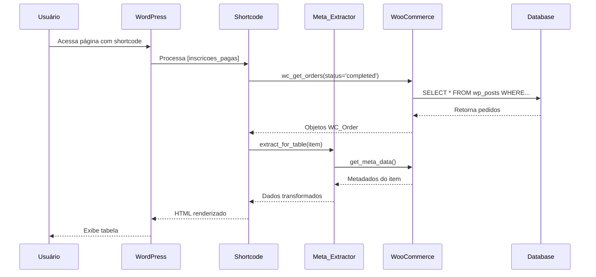

# Fluxo de Dados e Integrações

## Visão Geral do Fluxo de Dados

O plugin **Inscrições Pagas** opera como uma camada de visualização e gerenciamento sobre dados do WooCommerce. Os dados fluem do banco de dados WordPress (via WooCommerce API) → Meta_Extractor → Renderização (Shortcode ou AJAX) → Usuário. Operações de escrita seguem o caminho inverso com validação de segurança.

## Dependências entre Módulos

- **Plugin** → `Loader`, `Admin`, `Public\*`, `Ajax\*`, `Helpers\*`
- **Shortcode** → `Meta_Extractor`
- **Ajax Handlers** → `Meta_Extractor` (leitura), WooCommerce API (escrita)
- **CSV_Exporter** → `Meta_Extractor`
- **Todos os módulos** → WordPress Core, WooCommerce

## Camada de Serviços

### **Meta_Extractor** (`@includes/Helpers/class-meta-extractor.php:24`)
- **Responsabilidade**: Extrair e transformar metadados de itens de pedido WooCommerce
- **Métodos principais**:
  - `extract_from_item()` - Extrai todos os campos mapeados
  - `extract_for_table()` - Extrai apenas campos da tabela
  - `prepare_detail_data()` - Prepara dados para modal de detalhes

### **CSV_Exporter** (`@includes/Helpers/class-csv-exporter.php`)
- **Responsabilidade**: Exportar dados de inscrições para formato CSV
- **Métodos principais**:
  - `export()` - Gera arquivo CSV com todas as inscrições
  - `write_order_rows()` - Escreve linhas de dados de pedidos

### **Shortcode** (`@includes/Public/class-shortcode.php`)
- **Responsabilidade**: Renderizar tabela interativa de inscrições
- **Métodos principais**:
  - `render()` - Processa shortcode e renderiza template
  - `get_filtered_orders()` - Busca pedidos filtrados por produto

### **Ajax Handlers** (`@includes/Ajax/class-ajax-*.php`)
- **Responsabilidade**: Processar operações CRUD via AJAX
- **Classes**:
  - `Ajax_Inscrito` - Atualiza status de inscrito
  - `Ajax_Obs` - Gerencia observações
  - `Ajax_Checkbox` - Atualiza checkboxes genéricos
  - `Ajax_Meta` - Obtém/atualiza metadados
  - `Ajax_Export` - Exporta CSV

## Fluxo de Alto Nível

### **Fluxo de Leitura (Exibição da Tabela)**

```
1. Usuário acessa página com shortcode [inscricoes_pagas]
2. WordPress processa shortcode → Shortcode::render()
3. Shortcode busca pedidos WooCommerce com status 'completed'
4. Para cada pedido, extrai itens e metadados
5. Meta_Extractor::extract_for_table() transforma dados
6. Template renderiza tabela HTML com dados
7. Assets::enqueue_scripts() carrega CSS/JS
8. Usuário visualiza tabela interativa
```

### **Fluxo de Escrita (Atualização via AJAX)**

```
1. Usuário edita campo na tabela (ex: checkbox, observação)
2. JavaScript dispara requisição AJAX com nonce
3. WordPress roteia para handler Ajax apropriado
4. Handler valida nonce e permissões
5. Handler sanitiza dados recebidos
6. wc_update_order_item_meta() persiste no banco
7. Handler retorna JSON com sucesso/erro
8. JavaScript atualiza UI com feedback visual
```

### **Fluxo de Exportação CSV**

```
1. Usuário clica em botão "Exportar CSV"
2. JavaScript dispara requisição AJAX
3. Ajax_Export::handle() valida segurança
4. CSV_Exporter::export() busca pedidos
5. Para cada pedido, Meta_Extractor extrai dados
6. CSV_Exporter formata e gera arquivo
7. Headers HTTP configuram download
8. Navegador baixa arquivo inscricoes-YYYY-MM-DD.csv
```

## Movimento Interno de Dados

### **Extração de Metadados**

O `Meta_Extractor` usa um mapeamento configurável (`$meta_keys_map`) para traduzir nomes de campos WooCommerce em chaves internas:

```php
'nome_completo' => 'Nome completo',
'email' => 'E-mail',
'celular' => ['Celular - Incluir código do país', 'Celular - Incluir o DDD'],
```

Quando um campo tem múltiplas variações (array), tenta cada chave até encontrar valor.

### **Persistência de Dados**

Todas as operações de escrita usam a API do WooCommerce:
- `wc_update_order_item_meta($item_id, $meta_key, $value)` - Atualiza metadado
- `wc_get_order($order_id)` - Obtém objeto de pedido
- `$order->get_items()` - Obtém itens do pedido

Dados são armazenados na tabela `wp_woocommerce_order_itemmeta` do WordPress.

## Integrações Externas

### **WooCommerce API**
- **Propósito**: Gerenciar pedidos e metadados de produtos
- **Autenticação**: Integração nativa WordPress (mesma sessão)
- **Endpoints usados**:
  - `wc_get_orders()` - Busca pedidos por status
  - `wc_get_order()` - Obtém pedido específico
  - `wc_update_order_item_meta()` - Atualiza metadados
  - `wc_get_order_item_meta()` - Lê metadados
- **Retry**: Não implementado (operações síncronas)
- **Formato**: Objetos PHP nativos do WooCommerce

### **WordPress AJAX API**
- **Propósito**: Processar operações assíncronas
- **Autenticação**: Nonces WordPress (`wp_create_nonce`, `check_ajax_referer`)
- **Endpoints**:
  - `wp_ajax_ip_update_inscrito`
  - `wp_ajax_ip_update_obs`
  - `wp_ajax_ip_update_checkbox`
  - `wp_ajax_ip_get_meta`
  - `wp_ajax_ip_update_meta`
  - `wp_ajax_ip_export_csv`
- **Formato**: JSON (`wp_send_json_success`, `wp_send_json_error`)

## Observabilidade e Modos de Falha

### **Validação de Segurança**
- **Nonces**: Todos os handlers AJAX verificam nonce antes de processar
- **Capabilities**: Verifica permissões WordPress (`current_user_can`)
- **Sanitização**: Usa `sanitize_text_field`, `absint`, `esc_html`, `esc_attr`

### **Tratamento de Erros**
- **Requisitos não atendidos**: Exibe `admin_notices` se PHP/WordPress/WooCommerce incompatíveis
- **AJAX failures**: Retorna `wp_send_json_error` com mensagem
- **Dados ausentes**: Meta_Extractor retorna string vazia para campos não encontrados

### **Logs e Debugging**
- Não há sistema de logging implementado
- Erros são reportados via `wp_send_json_error` em AJAX
- Debug pode ser feito via `WP_DEBUG` e `error_log`

## Diagrama de Fluxo



## Recursos Relacionados

- **Arquitetura**: `architecture.md`
- **Glossário**: `glossary.md`
