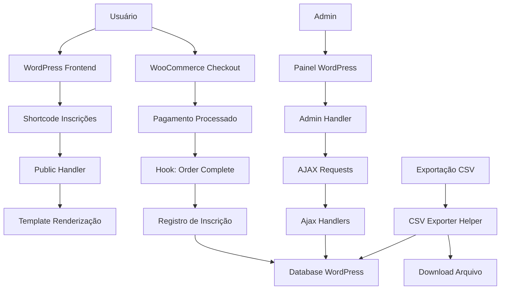

## Data Flow & Integrations

O plugin Inscrições Pagas gerencia dados de inscrições em eventos de xadrez, integrando-se ao WooCommerce para processamento de pagamentos e ao banco de dados WordPress para persistência.

## Module Dependencies

- **`includes/`** → `WordPress Core`, `WooCommerce`
- **`Admin/`** → `class-loader.php`, `Helpers/`
- **`Public/`** → `class-loader.php`, `templates/`
- **`Ajax/`** → `Helpers/`, `WordPress $wpdb`
- **`Helpers/`** → `WordPress $wpdb`

## Service Layer

- [`class-plugin.php`](../../includes/class-plugin.php) — Orquestração principal do plugin
- [`class-loader.php`](../../includes/class-loader.php) — Registro de hooks WordPress
- [`class-activator.php`](../../includes/class-activator.php) — Criação de tabelas e setup inicial
- [`class-csv-exporter.php`](../../includes/Helpers/class-csv-exporter.php) — Exportação de dados

## High-level Flow

## Internal Movement

### Fluxo de Inscrição
1. Usuário acessa página com shortcode do plugin
2. Public handler renderiza formulário/tabela via template
3. Dados são exibidos consultando $wpdb

### Fluxo de Pagamento
1. Usuário adiciona produto ao carrinho WooCommerce
2. Processa checkout e pagamento
3. Hook `woocommerce_order_status_completed` dispara registro
4. Dados da inscrição são salvos no banco

### Fluxo Admin
1. Administrador acessa painel do plugin
2. Interface carrega via Admin handler
3. Operações CRUD via AJAX para responsividade
4. 6 handlers AJAX disponíveis para diferentes operações

## External Integrations

### WooCommerce
- **Propósito**: Processamento de pagamentos e gestão de pedidos
- **Autenticação**: N/A (integração interna WordPress)
- **Retry**: Gerenciado pelo WooCommerce

### WordPress Database
- **Propósito**: Persistência de dados de inscrições
- **Acesso**: Via `$wpdb` global
- **Tabelas**: Tabelas customizadas criadas na ativação

## Observability & Failure Modes

- **Logs**: Utiliza `error_log()` para debugging
- **Validação**: Verificação de nonces em requisições AJAX
- **Fallback**: Mensagens de erro amigáveis para usuários
- **Rollback**: Desativação limpa via `class-deactivator.php`
